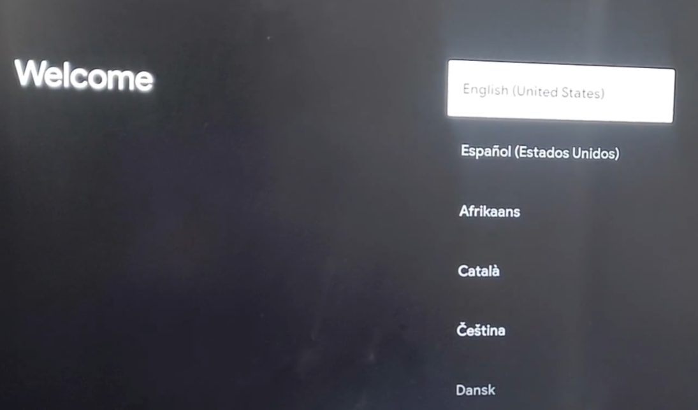
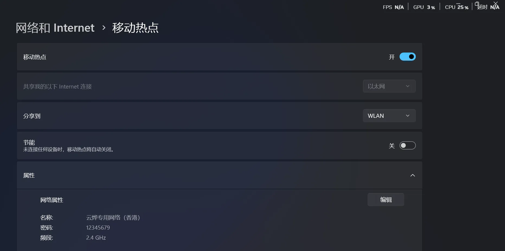

给位观众大家好呀，我是云烨。

说实话我想写这篇文章好久了，网上对于GoogleTV不使用软路由激活的方法几乎为零（笑）。本人最终由[B站链接](https://www.bilibili.com/opus/1005649768984084489)与[博客](https://vip2.loli.net/2023/09/22/nk7v24OZwzGfeFi.webp)这篇文章搞定的。现在以这个为蓝本仔细讲讲其中的细节。主要问题：***Google TV激活的时候无法连接网络,设备没法连接上time.android.com的时间同步ntp服务,导致不让激活设备***

让我们开始！

🔧【你要准备的】

1. 一台正常联网的纯净的支持热点的Windows系统（10及以上）
2. Google TV设备（插好电源连WiFi）
3. 能访问外网的加速器/梯子（手机端可用就行）

本次我用Google chromecast4k 白色款作为演示

将Google chromecast4k插上电视接通电源后点击机背按钮，打开系统欢迎页，如图示

调至中文简体后下一步

选择在电视端设置

跳到本页面后，将重心放置电脑来，电视端搁置一旁

打开电脑后，

修改Windows Hosts文件

203.107.6.88 [time.android.com](http://time.android.com/)

198.18.0.186 [clients3.google.com](http://clients3.google.com/)

随后打开Windows热点

用手机链接查看可用性，手机可用后，下一步

打开clash，进入设置

点击安装TUN模式（我已经安装好了，所以没有显示）

点击小齿轮，设置为如图所示

打开TUN模式

然后打开控制面板-网络与共享中心-更改适配器设置

（我没开没有）点击META选项卡，属性-共享-第一个打勾，选择热点网络名称（本地连接10）

然后回到电视

正常连接就好了（后续激活教程后文省略）

有什么疑问评论区都会答复的
